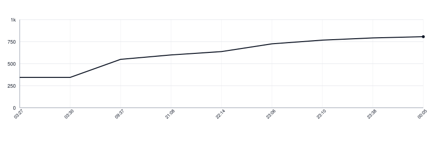

# wlmarkdown

[](https://github.com/wikilayer/wlmarkdown/actions/workflows/tests.yml)
[](https://pkg.go.dev/github.com/wikilayer/wlmarkdown)

The WikiLayer markdown dialect: GitHub-flavoured markdown, meaning CommonMark plus
tables, strikethrough, task lists and bare-URL linking, and then the constructs the
dialect adds of its own.

Today those are callouts and map embeds. A blockquote whose first line is exactly a
marker becomes a callout of that class:

```markdown
> [!WARNING]
> This cannot be undone.
```

| marker | class |
|---|---|
| `[!NOTE]` | `note` |
| `[!TIP]` | `tip` |
| `[!IMPORTANT]` | `important` |
| `[!WARNING]` | `warning` |
| `[!CAUTION]` | `caution` |

Anything else — a marker sharing its line with words, a marker nobody declared, a
quote without one — stays an ordinary quote.

A `[!MAP]` marker followed by a line of two numbers becomes a map embed. Whatever
follows the coordinates is its caption:

```markdown
> [!MAP]
> 44.7866, 20.4489
> Belgrade, the city centre
```

Both are digits carrying an optional sign and an optional fraction, and nothing
else: no exponent, no hexadecimal, no infinity. Anything else leaves the quote a
quote. They are handed on as the source wrote them, digit for digit, because
rounding a coordinate moves the point.

A link may name a node instead of a URL, under the scheme `page:` or `block:`:

```markdown
Read [the libraries page](page:42685) first.
```

The dialect names the scheme it recognises and hands the destination on character
for character. What follows a scheme is as often a name as a number, `page:home`
beside `page:42685`, and which names exist is a question a store answers, along with
whether anything is there at all and what URL it turns into.

A destination under no scheme of ours is reported with none. Whether it leads out of
the site or back into it is not the parser's to say either: `/wiki/page` is a local
address to whoever serves it and an unknown one here.

## Limitations

A callout inside a callout is one callout. The transformer stops at the first marker
it matches and looks no further down that quote, so the inner marker stays part of
the outer body.

A map inside a callout is found, because the callout is made first and the map is
looked for inside it afterwards. That order is a stated priority rather than an
accident of registration, and a corpus case goes red if it inverts. A link is found
wherever it sits, a callout included.

An autolink is not reported either. `<https://example.com/page>` stays whatever
CommonMark makes of it, and only a link written with brackets and a destination
comes back from `Recognise`.

Markdown is split on nesting callouts. GitHub, whose alert spelling this dialect
borrows, states that "alerts cannot be nested within other elements". Obsidian says
"you can nest callouts in multiple levels" and gives an example three deep, and
Material for MkDocs nests admonitions by indentation. Where the two disagree, this
dialect is neither a fresh choice nor a reading of that argument: it reproduces what
pages already written rely on.

## What this library does and does not do

It **recognises**. `New().Extensions()` hands over the goldmark extenders that parse
the dialect, and each node carries the one thing the source says: a callout its
class, a map its point.

It does not render, translate or resolve. A title for the callout, an icon, a
colour, a link target looked up in a store — all of that belongs to whoever holds
the page, because each of them answers differently on a web page and in an app.

Which markers exist is not among the things a caller sets. That table is what makes
the dialect this one rather than another, so `New()` is the only dialect there is.

`Markers()` names every marker that opens a construct here, `[!NOTE]` through
`[!MAP]`. A quote whose first line is one of them and which comes back from
`Recognise` as nothing was refused — the coordinates did not read as a point, say —
and the dialect says so by silence. With the list you can notice that silence
without writing the grammar out a second time.

`Classes()` and `Schemes()` name the values that can come back in `Found.Class` and
`Found.Scheme`, in sorted order. A host drawing an icon for each class, or resolving
each scheme, can hold its tables against these instead of keeping a second copy that
nothing compares. Both lists grow in a minor version, so read them rather than
writing down what is in them today.

## Use

`New().Recognise(source)` returns the flat list of dialect constructs found, in
document order:

```go
found := wlmarkdown.New().Recognise([]byte("> [!TIP]\n> Try the shorter form.\n"))
```

That list is what the corpus is written against, so every port of this library
answers the same questions with the same words.

To render, compose a goldmark of your own from the extenders and add a renderer for
each of the dialect's node kinds, `KindCallout` and `KindMapEmbed`:

```go
md := goldmark.New(
    goldmark.WithExtensions(wlmarkdown.New().Extensions()...),
    goldmark.WithRendererOptions(renderer.WithNodeRenderers(
        util.Prioritized(yourCalloutRenderer{}, 500),
        util.Prioritized(yourMapRenderer{}, 500),
    )),
)
```

Both renderers are yours to write, and a goldmark without them does not fail
politely: `Convert` panics with an index out of range the first time it meets a
node nobody registered a renderer for.

The nodes are yours to replace as well. A host that hangs a localized title on a
callout, or an embed URL on a map, does that in an AST transformer of its own, and
that transformer has to meet the node after the dialect has built it. Every
transformer this library registers runs below priority 200, so one registered at
200 or above runs after all of them:

```go
goldmark.WithParserOptions(parser.WithASTTransformers(
    util.Prioritized(yourCalloutDecoration{}, 200),
))
```

That bound is what the library promises, and a test here holds it. Read it from
this line rather than from the numbers in the source, which are free to move under
it.

## Running it

```sh
make test    # the corpus, plus the wiring test
make lint    # go vet, gofmt, staticcheck, commentcensor
```

## The corpus

`corpus/rules.yaml` holds what the dialect knows: which markers name which class,
which marker opens a map, which characters a coordinate is written from, which
characters count as blank, and which schemes a link may be written under.

The alphabets are spelled out rather than named, because a name is where ports
drift: `isDigit` in Kotlin admits Devanagari digits, `IsSpace` in Go admits the
non-breaking space and `Character.isWhitespace` in Java does not. A coordinate is
an optional sign, one or more digits, and optionally a point and one or more
digits. Words come back with every run of blanks squeezed to one space and the ends
trimmed, which is an outcome a port can check rather than an order of operations it
has to copy. `corpus/dialect.yaml` holds the cases it is defined by, a piece of
markdown and what must be recognised in it.

One thing the cases cannot reach is bare-URL linking. A port has to switch it on
all the same, because a page written against it renders differently without it, and
no case will say so: the flat list a case is written against reports no autolink to
compare.

Both files are the dialect, and the code is an implementation of them. Go reads the
rules out of the file it embeds rather than repeating them, and every port reads the
same two, which is what keeps them from drifting apart. A new marker or a new case
is added once and is then asked of all of them.

## Lines of Code

<picture>
  <source media="(prefers-color-scheme: dark)" srcset=".github/loc-history-dark.svg">
  <source media="(prefers-color-scheme: light)" srcset=".github/loc-history-light.svg">
  
</picture>
